# Project 2

<p align="center">
  
</p>

## Project Overview

This project contains the **UI and backend** for a student result management system. It demonstrates a fully containerized and automated deployment pipeline using **Kubernetes**, **ArgoCD**, **Prometheus**, **Grafana**, and **SonarQube**. The infrastructure is built for scalable and observable microservices, enabling CI/CD with robust monitoring and quality assurance tools.

## 📦 Deployment

In order to deploy the project, see [instructions](Instructions.md) for details.

## 🛠️ Tools & Technologies

- **Kubernetes** – Container orchestration
- **ArgoCD** – GitOps continuous delivery
- **Prometheus** – Metrics collection and alerting
- **Grafana** – Monitoring dashboards
- **Node Exporter** – Host-level metrics exporter
- **SonarQube** – Static code analysis
- **Kubernetes Dashboard** – Visual UI for managing workloads
- **Docker** – Containerization of applications
- **Helm** – Package management for Kubernetes

## 🚀 CI/CD Pipeline

<div align="center">


</div>

## 🔧 infrastructure

This project uses Terraform + Ansible to spin up a Kubernetes cluster with kubeadm.
- 🔧 Infrastructure provisioning → **Terraform**
- ⚙️ Cluster setup & configuration → **Ansible**
- 🎯 Target: Bare-metal cloud VMs (via SSH) → **AWS EC2**
- 🧠 Bootstrap: `kubeadm`-based Kubernetes install

### 🧱 Terraform – Infra Provisioning

Terraform handles EC2 instance creation, networking, and any cloud init scripts.

``` bash
$ cd terraform/kubeadm
$ terraform init
$ terraform apply -auto-approve
```

[](https://github.com/rootminusone8004/terraform)

### ⚙️ Ansible – Kubernetes Setup

Once the infra is live, Ansible kicks in to install and configure Kubernetes using `kubeadm`

``` bash
$ cd ansible/
$ ansible all -i inventory/kubeadm.yaml -m ping
$ ansible-playbook --ask-become-pass --skip-tags "docker_only" -i inventory/kubeadm.yaml playbooks/kubeadm.yaml
```

[](https://github.com/rootminusone8004/ansible)

This playbook handles:
- Installing containerd
- Running kubeadm init
- Setting up kubectl access

### 🗺️ Flow Summary

```mermaid
flowchart

    A(Terraform: Provision Infra) --> B(Ansible: Configure Kubernetes)
    B --> C(kubeadm init / join)
    C --> D(Cluster Ready ✅)
```

<div align="center">


</div>

## 📸 Dashboards & Monitoring screenshots

### 🔹 ArgoCD (GitOps Management)

<p align="center">
  
  <br><i>Cluster nodes</i>
</p>

<p align="center">
  
  <br><i>Backend pods</i>
</p>

<p align="center">
  
  <br><i>Frontend pods</i>
</p>

<p align="center">
  
  <br><i>Other pods</i>
</p>

<p align="center">
  
  <br><i>Cluster Metrics</i>
</p>

### 🔹 Kubernetes Dashboard

<p align="center">
  
  <br><i>kubernetes deployments</i>
</p>

<p align="center">
  <br>
  
  <br><i>kubernetes pods</i>
</p>

<p align="center">
  
  <br><i>replica sets</i>
</p>

<p align="center">
  
  <br><i>stateful sets</i>
</p>

<p align="center">
  
  <br><i>workload</i>
</p>

<p align="center">
  
  <br><i>Terminal showing pods and services</i>
</p>

### 🔹 Monitoring Stack

#### 📊 Grafana Dashboards

<p align="center">
  <br>
  
  <br><i>CPU metrics</i>
</p>

<p align="center">
  <br>
  
  <br><i>pods' resource metrics</i>
</p>

#### 📊 Prometheus Dashboards

<p align="center">
  
  <br><i>CPU metrics</i>
</p>

<p align="center">
  
  <br><i>Network metrics</i>
</p>

<p align="center">
  
  <br><i>Healthy pods</i>
</p>

<p align="center">
  
  <br><i>Memory usage query</i>
</p>

### 🎯 Sonarqube code analysis

<p align="center">
  
  <br><i>Quality gate passing</i>
</p>

<p align="center">
  
  <br><i>Detailed view</i>
</p>

## 📄 License

This project is licensed under MIT license. See the [LICENSE](LICENSE.txt) file for details.
